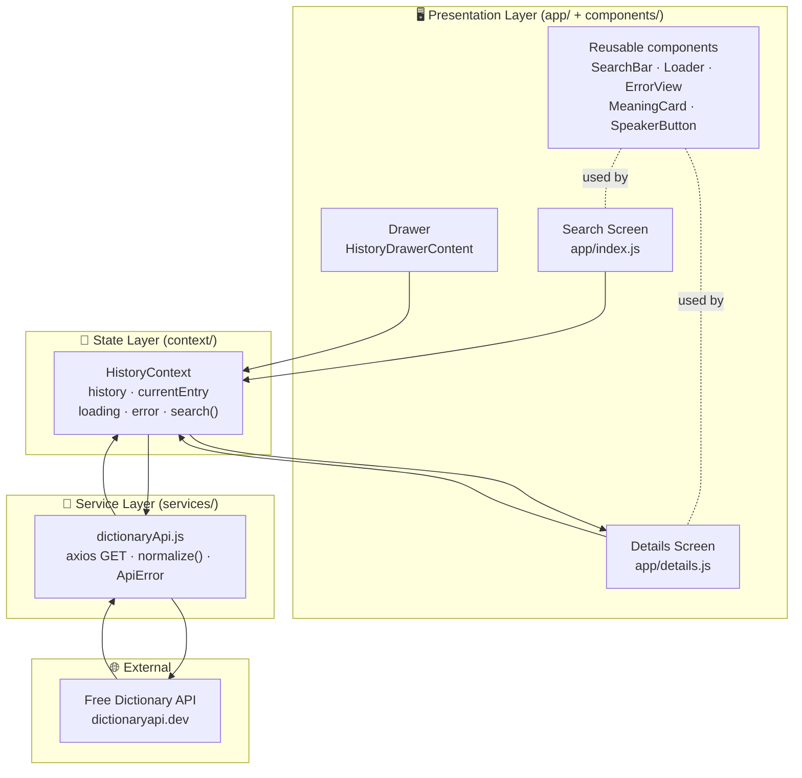

# 🏛️ App Architecture — Dictionary Mobile App

**Client:** LexiTech Solutions Ltd
**Stack:** React Native · Expo SDK 54 · Expo Router · Drawer Navigation · Axios · expo-audio · expo-linear-gradient

---

## 1. High-level architecture

The app follows a **layered, separation-of-concerns** architecture. UI never talks
to the network directly — it goes through Context → Service → API.



### ASCII fallback

```
┌───────────────────────────────────────────────────────────────┐
│  PRESENTATION  (app/ + components/)                            │
│   Search Screen · Details Screen · Drawer · Reusable UI        │
└───────────────┬───────────────────────────────────────────────┘
                │ read state / call search()
┌───────────────▼───────────────────────────────────────────────┐
│  STATE  (context/HistoryContext.js)                           │
│   history[] · currentEntry · loading · error · search()        │
└───────────────┬───────────────────────────────────────────────┘
                │ fetchWord()
┌───────────────▼───────────────────────────────────────────────┐
│  SERVICE  (services/dictionaryApi.js)                         │
│   axios GET · normalize() · error classification (ApiError)    │
└───────────────┬───────────────────────────────────────────────┘
                │ HTTPS
┌───────────────▼───────────────────────────────────────────────┐
│  EXTERNAL   Free Dictionary API (dictionaryapi.dev)           │
└───────────────────────────────────────────────────────────────┘
```

---

## 2. Folder structure

```
mobile_ne/
├── app/                          # Expo Router pages (file-based routing)
│   ├── _layout.js                # Providers + Drawer navigator + audio mode
│   ├── index.js                  # Search screen  → route "/"
│   └── details.js                # Word details   → route "/details"
│
├── components/                   # Reusable, presentational UI
│   ├── SearchBar.js              # Input + clear + Search button
│   ├── Loader.js                 # Spinner card
│   ├── ErrorView.js              # Error card + Retry (adaptive icon)
│   ├── MeaningCard.js            # POS group: numbered defs + examples
│   ├── SpeakerButton.js          # Audio PLAY / PAUSE / STOP controls
│   └── HistoryDrawerContent.js   # Custom drawer (gradient header + history)
│
├── services/
│   └── dictionaryApi.js          # axios GET + normalize + ApiError mapping
│
├── context/
│   └── HistoryContext.js         # Shared state + search() flow
│
├── constants/
│   ├── colors.js                 # Color palette + SHADOW preset
│   └── config.js                 # API base URL + request timeout
│
├── document/                     # 📄 Design docs (this folder)
│   ├── ARCHITECTURE.md
│   ├── DATA_FLOW.md
│   └── REQUIREMENTS.md
│
├── app.json · babel.config.js · package.json · README.md
```

---

## 3. Why this design

| Decision | Reasoning |
|----------|-----------|
| **Context holds `search()`** | Both the Search screen *and* the drawer trigger the same fetch. Centralizing it avoids duplicated logic and keeps a single source of truth for `loading`/`error`/`currentEntry`. |
| **Service layer isolates axios** | Screens stay declarative. All network quirks (404, timeout, malformed body) are normalized in one place into a predictable shape + typed `ApiError`. |
| **Presentational components** | `SearchBar`, `MeaningCard`, etc. receive props only — easy to reuse, test, and restyle. |
| **Expo Router (file-based)** | `app/index.js` and `app/details.js` map directly to routes; `_layout.js` wires the drawer once. |
| **`currentEntry` in state, not params** | Avoids serializing large objects through navigation; the drawer and screen render the same parsed entry. |

---

## 4. Navigation map

```
Drawer (app/_layout.js)
 ├─ "Search"  → index.js   (route "/")
 ├─ "Details" → details.js (route "/details")
 └─ Search History (dynamic) → each tap re-fetches → "/details"
```

---

## 5. Tech components reference

| Concern | Package |
|---------|---------|
| Routing | `expo-router` |
| Drawer | `@react-navigation/drawer` + `react-native-gesture-handler` + `react-native-reanimated` |
| HTTP | `axios` |
| Audio | `expo-audio` (`useAudioPlayer`, `useAudioPlayerStatus`, `setAudioModeAsync`) |
| Gradients | `expo-linear-gradient` |
| Icons | `@expo/vector-icons` (Ionicons) |
| Safe areas | `react-native-safe-area-context` |
