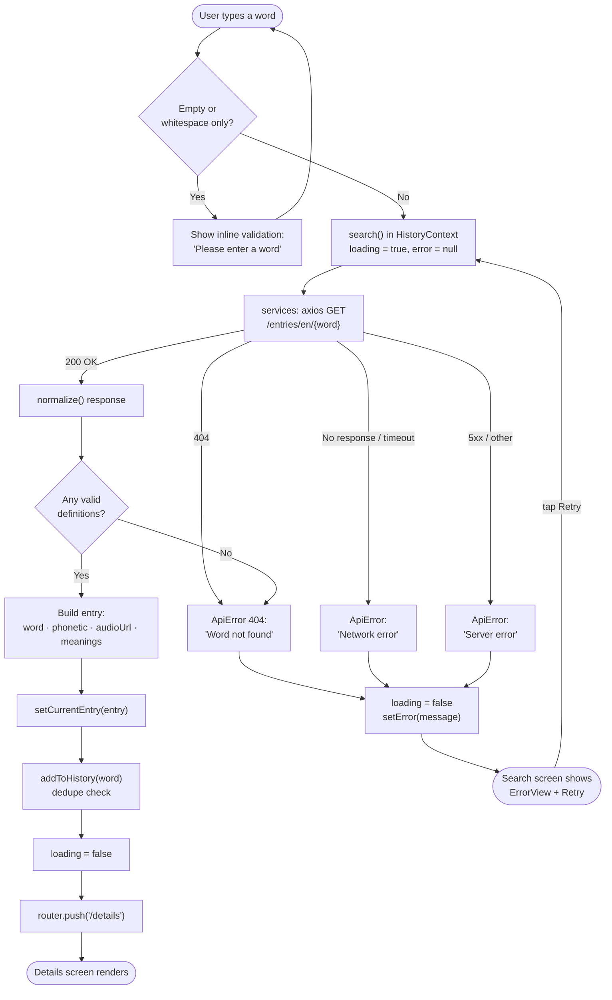
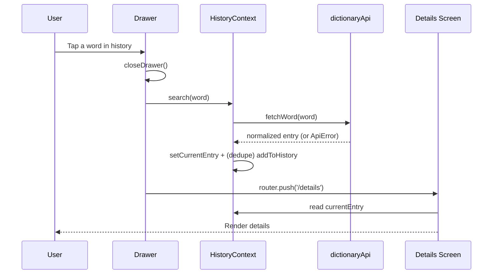
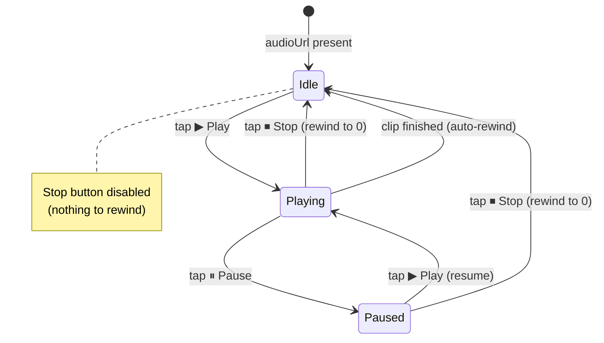

# 🔄 Data Flow — Dictionary Mobile App

End-to-end journey of a search, from keystroke to rendered definition, including
every validation and error branch.

---

## 1. Primary data flow (happy path + branches)



---

## 2. Linear summary

```
User input
   │  validate: empty? whitespace-only?  ──► (fail) inline message
   ▼
search(word)               loading = true
   ▼
axios GET /entries/en/{word}
   ├─ 200 ─► normalize() ─► definitions exist? ─► build entry
   │                                   └─(no)─► ApiError 'Word not found'
   ├─ 404 ────────────────────────────────────► ApiError 'Word not found'
   ├─ timeout / offline ──────────────────────► ApiError 'Network error'
   └─ 5xx ────────────────────────────────────► ApiError 'Server error'
   ▼ (success)
setCurrentEntry(entry) → addToHistory(word, dedupe) → loading = false
   ▼
navigate to /details → render word, phonetic, audio, meanings
   ▲
   └────────── Drawer history tap re-enters search(word) ──────────┘
```

---

## 3. History reuse flow



---

## 4. Audio playback state machine (Activity 3)

`SpeakerButton` only mounts when `audioUrl` exists.



| State | Play/Pause icon | Stop button | Label |
|-------|-----------------|-------------|-------|
| Idle | ▶ Play | disabled | "Tap to listen" |
| Playing | ⏸ Pause | enabled | "Playing…" |
| Paused (mid-clip) | ▶ Play | enabled | "Paused" |

---

## 5. State ownership

| State | Owner | Lifetime |
|-------|-------|----------|
| `word` (text input) | Search screen (`useState`) | Per screen |
| `validationError` | Search screen | Per submit |
| `history[]` | HistoryContext | App session |
| `currentEntry` | HistoryContext | Until next search |
| `loading` / `error` | HistoryContext | Per request |
| audio `playing` / `currentTime` | `useAudioPlayerStatus` | Per Details mount |
